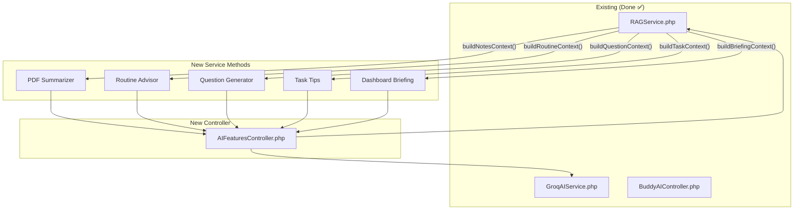

# 🧠 Campus Buddy — Full AI Integration Master Plan

> **Status**: ✅ Phase 1 & Phase 2 Complete  
> **AI Engine**: Groq Cloud API (`llama-3.3-70b-versatile`)  
> **Completed**: ✅ Buddy AI Chat + ✅ Visitor AI Chat + ✅ Dashboard Briefing + ✅ Routine Advisor + ✅ Task Tips + ✅ Notes Summarizer + ✅ Question Bank Generator

---

## 📍 Discovery — Where AI Is Needed

After analyzing every Blade view, controller, and component in the project, I identified **6 additional AI integration points** where your existing `<x-buddy-card>` components or features are **already UI-ready** but have **no backend AI logic**:

| # | Feature | Page | Current State | AI Opportunity |
|---|---------|------|--------------|----------------|
| 1 | **PDF & Notes Summarizer** | `notes.blade.php` L298-305 | Static buddy card → links to chat | Summarize uploaded PDFs, extract key topics |
| 2 | **Personalized Routine Advisor** | `routine.blade.php` L265-272 | Static buddy card → links to chat | Analyze schedule, suggest study plans, find free slots |
| 3 | **Question Bank Practice Generator** | `questionbank.blade.php` L130-135 | Static buddy card → links to chat | Generate practice quizzes from past questions |
| 4 | **Class Task AI Tips** | `classtask.blade.php` L137-160 | Hardcoded `tip_1`, `tip_2` from DB | Generate dynamic, context-aware tips per task |
| 5 | **Smart Dashboard Briefing** | `dashboard.blade.php` L42-44 | Static Buddy glass card | Generate daily AI briefing from schedule + tasks |
| 6 | **Community Post Moderation** | `community.blade.php` | No AI | Auto-moderate/flag inappropriate posts |

---

## 🏗️ Architecture Overview

All features will share the **same backend infrastructure** we already built:



> [!IMPORTANT]
> All 6 features reuse `GroqAIService.php` — **no new API clients needed**. We just add context-building methods to `RAGService.php` and endpoint methods to a new `AIFeaturesController.php`.

---

## Feature 1: PDF & Notes Summarizer

### What It Does
When a student views the Notes page, they can click "Summarize with AI" on any uploaded PDF/note. The AI reads the document's metadata (title, course code, department) and generates:
- A **concise summary** of what the material likely covers
- **Key topics** and concepts to study
- **Practice questions** derived from the topic

### Technical Design

**Route:**
```php
Route::post('/api/ai/summarize-notes', [AIFeaturesController::class, 'summarizeNotes'])
    ->middleware(['auth', 'throttle:15,1'])
    ->name('api.ai.summarize-notes');
```

**RAGService Method:**
```php
public function buildNotesContext(User $user, array $materialData): string
{
    // $materialData = ['title', 'course_code', 'department', 'file_extension', 'type']
    return "You are an expert academic tutor for {$user->department} students.
    
    The student is viewing this material:
    - Title: {$materialData['title']}
    - Course: {$materialData['course_code']}
    - Department: {$materialData['department']}
    - File Type: {$materialData['file_extension']}
    - Material Type: {$materialData['type']} (class_material or hand_note)
    
    Based on the course code and title, provide:
    1. A likely summary of what this material covers (2-3 paragraphs)
    2. 5-7 key topics/concepts the student should focus on
    3. 3 practice questions to test understanding
    
    Be specific to the course content. If you recognize the course code, use your knowledge of that subject.";
}
```

**Frontend Changes (`notes.blade.php`):**
- Replace the static `<x-buddy-card>` at L298-305 with an **inline AI panel**
- Each PDF/Note card gets a small "✨ AI Summary" button
- Clicking it opens a slide-out panel with a loading spinner → AI response

### Complexity: 🟡 Medium
> Phase 1 used metadata-only. **Phase 2 (Completed)** added `smalot/pdfparser` for actual text extraction, enabling deep, content-aware summaries.

---

## Feature 2: Personalized Routine Advisor

### What It Does
On the Routine page, the "Personalize with AI" buddy card becomes a functional AI feature that can:
- Analyze the student's weekly schedule for **gap analysis** (free slots, overloaded days)
- Suggest **optimal study time** blocks between classes
- Provide a **daily prep briefing** ("Your next class is Algorithm at 10 AM in Room 501 — review Chapter 5")
- **Conflict detection** if overlapping classes exist

### Technical Design

**Route:**
```php
Route::post('/api/ai/routine-advisor', [AIFeaturesController::class, 'routineAdvisor'])
    ->middleware(['auth', 'throttle:20,1'])
    ->name('api.ai.routine-advisor');
```

**RAGService Method:**
```php
public function buildRoutineContext(User $user): string
{
    $schedules = Schedule::where('department', $user->department)
        ->where('batch', $user->batch)
        ->where('section', $user->section)
        ->orderBy('day')
        ->orderBy('time_slot')
        ->get();

    $routineStr = '';
    foreach ($schedules->groupBy('day') as $day => $classes) {
        $routineStr .= "\n$day:\n";
        foreach ($classes as $c) {
            $routineStr .= "  - {$c->time_slot}: {$c->course_title} ({$c->course_code}) | Room {$c->room_no} | {$c->teacher_initial}\n";
        }
    }

    $todayName = now()->format('l');

    return "You are a smart academic schedule advisor for {$user->name}.
    Student: {$user->department}, Batch {$user->batch}, Section {$user->section}
    Today is: {$todayName}, " . now()->format('g:i A') . "
    
    Their FULL weekly schedule:
    {$routineStr}
    
    You can:
    1. Tell them what's coming up next today
    2. Identify free time slots for studying
    3. Suggest study-break patterns
    4. Flag any schedule conflicts
    5. Recommend preparation strategies
    
    Be conversational, helpful, and specific to their actual schedule data.";
}
```

**Frontend Changes (`routine.blade.php`):**
- Replace the `<x-buddy-card>` at L265-272 with an **AI chat widget** embedded inline
- Include quick-action pills: "What's my next class?", "Find free time today", "Weekly overview"
- Results appear in a styled response box below the pills

### Complexity: 🟢 Easy
> All data is already queryable from `schedules` table. No external parsing needed.

---

## Feature 3: Question Bank Practice Generator

### What It Does
On the Question Bank page, the "Practice with AI" card becomes a live feature that can:
- Generate **practice quizzes** from the question bank's existing data (course, topic, difficulty)
- Create **new practice questions** in the style of past exams for a given course
- Explain **step-by-step solutions** for specific question topics
- Recommend **study focus areas** based on frequency analysis of past questions

### Technical Design

**Route:**
```php
Route::post('/api/ai/practice-generator', [AIFeaturesController::class, 'practiceGenerator'])
    ->middleware(['auth', 'throttle:15,1'])
    ->name('api.ai.practice-generator');
```

**RAGService Method:**
```php
public function buildQuestionBankContext(User $user, ?string $courseCode = null): string
{
    $query = QuestionBank::query();
    if ($courseCode) {
        $query->where('course_code', $courseCode);
    }
    $questions = $query->latest()->take(20)->get();

    $questionsStr = '';
    foreach ($questions as $q) {
        $questionsStr .= "\n---\nCourse: {$q->course_code} | {$q->course_name}\n";
        $questionsStr .= "Title: {$q->title}\n";
        $questionsStr .= "Difficulty: {$q->difficulty}\n";
        $questionsStr .= "Question: {$q->question_heading}\n";
        $questionsStr .= "Sub-questions: {$q->sub_questions}\n";
        $questionsStr .= "Tags: {$q->tags}\n";
        $questionsStr .= "Semester: {$q->year_semester}\n";
    }

    return "You are an expert exam preparation assistant for {$user->department} students.
    
    Here are past exam questions from the question bank:
    {$questionsStr}
    
    Based on these patterns, you can:
    1. Generate NEW practice questions in similar style and difficulty
    2. Explain concepts behind specific questions
    3. Identify frequently tested topics
    4. Create mini-quizzes (5 questions) for specific courses
    5. Suggest study strategies based on question patterns
    
    Always format questions clearly with proper numbering.";
}
```

**Frontend Changes (`questionbank.blade.php`):**
- Replace the `<x-buddy-card>` at L130-135 with an interactive panel
- Add a course selector dropdown + "Generate Quiz" button
- Quick pills: "Generate 5 MCQs for [course]", "Explain this topic", "Most tested topics"
- Results render in a styled card below with markdown support

### Complexity: 🟡 Medium
> Requires iterating over question bank entries. The prompt context size should be managed (limit to 20 questions).

---

## Feature 4: Class Task AI Tips (Dynamic)

### What It Does
Currently, each class task card shows hardcoded `tip_1` and `tip_2` from the database (set by admin via Filament). This feature makes those tips **dynamically AI-generated** based on:
- The task's **type** (assignment, quiz, presentation)
- The task's **topic** and course
- **Days remaining** until deadline
- The student's **current workload**

### Technical Design

**Route:**
```php
Route::post('/api/ai/task-tips', [AIFeaturesController::class, 'generateTaskTips'])
    ->middleware(['auth', 'throttle:20,1'])
    ->name('api.ai.task-tips');
```

**RAGService Method:**
```php
public function buildTaskTipContext(User $user, array $taskData): string
{
    $daysLeft = Carbon::parse($taskData['deadline'])->diffInDays(now(), false);
    $urgency = $daysLeft > 3 ? 'plenty of time' : ($daysLeft > 0 ? 'approaching deadline' : 'OVERDUE');

    return "You are a smart study assistant for {$user->name} ({$user->department}).
    
    They have this task:
    - Type: {$taskData['type']}
    - Title: {$taskData['title']}
    - Course: {$taskData['course_code']}
    - Topic: {$taskData['topic']}
    - Deadline: {$taskData['deadline']}
    - Status: {$urgency} ({$daysLeft} days left)
    - Description: {$taskData['description']}
    
    Generate 2 actionable, specific study tips for this task.
    Keep each tip under 2 sentences. Be encouraging and practical.
    Format as JSON: {\"tip_1\": \"...\", \"tip_2\": \"...\"}";
}
```

**Frontend Changes (`classtask.blade.php`):**
- Add a small "✨ AI Tips" toggle button on each task card
- When clicked, fetches fresh tips from `/api/ai/task-tips` with the task data
- Replaces the static `tip_1` / `tip_2` content with the AI response
- Falls back to original DB tips if AI fails

### Complexity: 🟢 Easy
> Simple: send task data, get 2 tips back. Can be cached per task for 1 hour.

---

## Feature 5: Smart Dashboard Briefing

### What It Does
The dashboard's "Buddy AI" glass card (L42-44) currently says "Need a helping hand?" with a generic CTA. This feature turns it into a **live daily AI briefing** that auto-generates when the dashboard loads:

- "Good morning, Washim! You have 3 classes today starting at 10 AM..."
- "⚠️ Your CSE 421 assignment is due tomorrow — start the Database section first"
- "📊 You've completed 4/7 tasks this week — great progress!"

### Technical Design

**Route:**
```php
Route::get('/api/ai/daily-briefing', [AIFeaturesController::class, 'dailyBriefing'])
    ->middleware(['auth', 'throttle:10,1'])
    ->name('api.ai.daily-briefing');
```

**RAGService Method:**
```php
public function buildBriefingContext(User $user): string
{
    // Reuse existing methods from RAGService
    $scheduleContext = $this->getScheduleContext($user);
    $taskContext = $this->getTaskContext($user);
    $announcementContext = $this->getAnnouncementContext($user);

    return "You are Buddy, the Campus Buddy AI assistant.
    Generate a brief, warm daily briefing for {$user->name}.
    Today is " . now()->format('l, F j, Y') . " at " . now()->format('g:i A') . ".
    
    {$scheduleContext}
    {$taskContext}
    {$announcementContext}
    
    Create a 3-4 sentence personalized briefing covering:
    1. Today's class schedule overview
    2. Any urgent upcoming deadlines
    3. A motivational closing line
    
    Keep it under 100 words. Be warm and encouraging. Use emojis sparingly.";
}
```

**Frontend Changes (`dashboard.blade.php`):**
- Replace the static `glass-content` text (L41-49) with a dynamic container
- On page load, `fetch('/api/ai/daily-briefing')` populates the briefing
- Add a subtle "Refresh" icon to regenerate
- Cache on server for 30 minutes per user

### Complexity: 🟢 Easy
> Mostly reuses existing RAGService context methods. Small frontend change.

---

## Feature 6: Community Post Auto-Moderation (Optional/Future)

### What It Does
When a student submits a new community post, the AI silently checks it for:
- Inappropriate language or harassment
- Spam/promotional content
- Off-topic content that should be in a different channel

### Technical Design

**Implementation**: Server-side only — runs in `PostController@store` before saving.

```php
// In PostController::store(), before $post->save()
$moderationResult = app(GroqAIService::class)->chat(
    systemPrompt: "You are a content moderator. Analyze this post for a university community platform. 
    Respond with JSON: {\"safe\": true/false, \"reason\": \"...\"}
    Flag content that is: hateful, spam, NSFW, or contains personal attacks.",
    userMessage: $request->content,
    history: []
);
```

### Complexity: 🔴 Advanced
> Requires careful prompt engineering to avoid false positives. Should be Phase 3.

---

## 📋 Implementation Schedule

### Phase 1 — Quick Wins (1-2 days)
| Priority | Feature | Files to Modify | Effort |
|----------|---------|----------------|--------|
| P1 | Smart Dashboard Briefing | `dashboard.blade.php`, `RAGService.php`, new controller | ~2 hours |
| P1 | Personalized Routine Advisor | `routine.blade.php`, `RAGService.php`, new controller | ~2 hours |
| P1 | Class Task AI Tips | `classtask.blade.php`, `RAGService.php`, new controller | ~2 hours |

### Phase 2 — Core Features (2-3 days)
| Priority | Feature | Files to Modify | Effort |
|----------|---------|----------------|--------|
| P2 | PDF & Notes Summarizer | `notes.blade.php`, `RAGService.php`, new controller | ~4 hours |
| P2 | Question Bank Practice Gen | `questionbank.blade.php`, `RAGService.php`, new controller | ~4 hours |

### Phase 3 — Polish (Future & Completed)
| Priority | Feature | Files to Modify | Effort |
|----------|---------|----------------|--------|
| P3 | Community Moderation | `PostController.php` | ~3 hours |
| ✅ P3 | PDF Text Extraction | `smalot/pdfparser` package added | Completed |

---

## 🗂️ Files to Create

| File | Purpose |
|------|---------|
| `app/Http/Controllers/AIFeaturesController.php` | All 6 feature endpoints |
| Updates to `app/Services/RAGService.php` | New context-building methods |
| Updates to `routes/web.php` | New API routes |
| Frontend updates to 4 Blade views | Wire up fetch() calls |

---

## 🔧 Configuration Requirements

No additional packages or API keys needed — everything runs on the existing:
- `GROQ_API_KEY` (already in `.env`)
- `GroqAIService.php` (already built)
- `RAGService.php` (will be extended)

> [!TIP]
> All features share the same Groq API quota. The rate limiting on each endpoint ensures we stay within Groq's free tier limits (~30 req/min across all features).

---

## 🎯 Which to Build First?

My recommendation for maximum **hackathon demo impact**:

1. **🥇 Dashboard Briefing** — Instant wow factor on login, shows the AI is "alive"
2. **🥈 Routine Advisor** — Demonstrates personalized RAG with real schedule data  
3. **🥉 Question Generator** — Most impressive for academic use case
