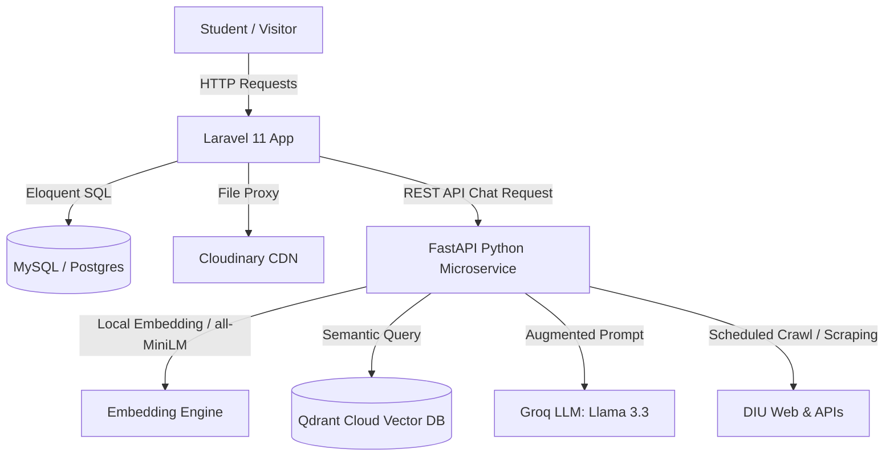

# Campus Buddy — Storage & Database FAQ

> **Last updated:** July 2026 (local dev session)
> This document answers exactly where every piece of data and every file in Campus Buddy lives — locally or in the cloud.

---

## 🗄️ Database Questions

### Q1 — Where is the main database?
**A:** All structured data (users, schedules, posts, notes metadata, chat history, question bank, events, clubs, etc.) is stored in a **local MySQL database** running on your own machine.

| Setting | Value |
|---|---|
| Driver | `mysql` |
| Host | `127.0.0.1` (localhost) |
| Database name | `User_DB` |
| Cache driver | `database` (same local MySQL) |
| Session driver | `database` (same local MySQL) |

No database data is sent to any cloud service. Everything stays on your machine.

---

### Q2 — Which features read and write to the local database?
**A:** Every feature that stores records uses the local MySQL DB:

| Feature | Tables Used |
|---|---|
| User accounts & auth | `users` |
| Class routine / schedule | `schedules` |
| Notes & class materials (metadata) | `materials` |
| Community posts & likes | `posts`, `likes`, `comments`, `comment_likes` |
| Buddy AI chat history | `ai_chats` |
| Question bank | `question_banks` |
| Campus events | `events` |
| Clubs | `clubs` |
| Alumni directory | `alumni_registrations` |
| Talent showcase | `talents` |
| Announcements | `announcements` |
| Docs / Team | `docs_sections`, `docs_settings`, `docs_team_members` |

---

## 🌥️ Cloudinary Questions

### Q3 — What is Cloudinary used for?
**A:** Cloudinary is a cloud media storage service. Campus Buddy uses it to host **uploaded images and documents** so they are available on any device/internet connection, not just your local machine.

---

### Q4 — Which features still upload files to Cloudinary?

| Feature | What is uploaded | Cloudinary folder |
|---|---|---|
| **Profile image** (signup & profile edit) | User avatar photo | `profile_images/` |
| **Community posts** | Post attachment (image/PDF) | `posts/attachments/` |
| **Campus events** | Event banner/image | `events/` |
| **Question bank** | Exam paper scans / PDFs | `question_banks/` |
| **Alumni directory** | Profile photo + company logo | `alumni/` |

> **Status:** These features **still use Cloudinary** and have not been changed.

---

### Q5 — Which features were changed to use local storage instead of Cloudinary?

| Feature | Old behaviour | New behaviour (local dev) |
|---|---|---|
| **Class materials / PDF notes upload** | Uploaded to Cloudinary as raw file | **Saved locally** to `storage/app/public/materials/` |

> **Why changed?** Files stored on Cloudinary get a raw extensionless URL (e.g. `ox4ai6suqkmjsk7vpkek`) with no MIME type header. This broke:
> - The **AI PDF/Note Summarizer** (could not parse the file)
> - The **View / Download** buttons (downloaded as unreadable binary file)
>
> Saving locally means the file is readable directly by the PHP parser with no HTTP round-trip.

---

### Q6 — I uploaded materials before this change. Are those old files still on Cloudinary?
**A:** Yes. Files uploaded **before** the local-storage switch have Cloudinary URLs like `https://res.cloudinary.com/...` stored in the database. Of the 17 materials currently in the database:

| Storage | Count |
|---|---|
| Cloudinary (old uploads) | 11 |
| Local disk (new uploads) | 6 |

The app handles both automatically — it detects whether the path is an HTTP URL (Cloudinary) or a relative path (local) and routes accordingly.

---

### Q7 — Can the AI Summarizer read files from both local and Cloudinary?
**A:** Yes, both are now supported:

| File location | How the AI reads it |
|---|---|
| **Local** (`storage/app/public/...`) | Reads the file directly from disk — fastest |
| **Cloudinary** (`https://...`) | Downloads the file to a temporary file on the server, parses it, then deletes the temp file |

After reading the file content, it is extracted as text (PDF → `smalot/pdfparser`, PPTX → `ZipArchive` XML reader, DOCX/DOC → `phpoffice/phpword`) and sent to the Groq AI API.

---

## 🤖 AI / External API Questions

### Q8 — What external API does the AI use?
**A:** All AI features (Buddy AI chat, PDF Summarizer, Routine Advisor, Daily Briefing, Question Bank) use the **Groq Cloud API** (not a local model).

| Setting | Value |
|---|---|
| API Provider | Groq (https://groq.com) |
| Model | `llama-3.3-70b-versatile` |
| Max tokens per response | `3072` |
| Temperature | `0.7` |
| Timeout | `60 seconds` |

The API key is stored in your local `.env` file as `GROQ_API_KEY`. Nothing from your database is sent to Groq except the context/prompt text the AI needs to answer questions.

---

### Q9 — Does the AI store my conversations anywhere in the cloud?
**A:** No. Conversation messages are stored only in your **local MySQL database** (`ai_chats` table). The Groq API receives only the current session message content to generate a reply — it does not persist anything.

---

## 📁 File View / Download Questions

### Q10 — Why did View / Download used to give an unreadable file?
**A:** Cloudinary stores raw uploads with no file extension in the URL and returns them with a generic `application/octet-stream` MIME type. Browsers do not know what to do with that, so they save it as a nameless binary file.

---

### Q11 — How does View / Download work now?
**A:** Both buttons now go through a **secure Laravel backend proxy** (`/notes/view/{id}` and `/notes/download/{id}`):

1. The backend fetches the file content (local disk or Cloudinary)
2. Sets the correct MIME type (e.g. `application/pdf` for PDFs, `application/vnd.openxmlformats-officedocument.presentationml.presentation` for PPTX)
3. Sets a proper filename from the material title and extension (e.g. `types-of-machine-learning.pptx`)
4. Streams it to the browser

This means **View** opens natively in the browser tab, and **Download** saves a properly named, openable file.

---

## 🧩 Quick Reference Summary

| Feature | Data in | Files in |
|---|---|---|
| User accounts | Local MySQL | Local MySQL |
| Class schedule / routine | Local MySQL | — |
| Notes / class materials (metadata) | Local MySQL | **New → Local disk** / Old → Cloudinary |
| Community posts | Local MySQL | Cloudinary |
| Buddy AI chat history | Local MySQL | — |
| Question bank | Local MySQL | Cloudinary |
| Campus events | Local MySQL | Cloudinary |
| Clubs | Local MySQL | — |
| Profile images | Local MySQL | Cloudinary |
| Alumni directory | Local MySQL | Cloudinary |
| AI responses (Groq) | Local MySQL | — (API only) |

---

> **Note:** The local-storage switch for class materials applies to your **local development environment only** and has not been pushed to the live GitHub repository.

---

## 🛠️ Self-Debugging & Error Troubleshooting

### Q12 — I got a "500 Internal Server Error". How do I find out what caused it?
**A:** In a Laravel application, there are **three primary ways** to see the exact error message, filename, and line number causing the crash:

#### Method 1: Check Laravel's Log File (Most Reliable)
Whenever Laravel encounters a crash, it writes a detailed error stack trace to the log file on disk.
- **Location:** `storage/logs/laravel.log` (relative to the project root directory).
- **How to read it via Terminal:**
  - View the last 50 lines of logs:
    ```bash
    tail -n 50 storage/logs/laravel.log
    ```
  - View live logs in real time as they happen:
    ```bash
    tail -f storage/logs/laravel.log
    ```

#### Method 2: Enable Browser Debug Mode
If your local development environment shows a generic, grey "500 Server Error" screen, it means detailed error reporting is turned off.
1. Open the `.env` file in your project root.
2. Find the `APP_DEBUG` key and set it to `true`:
   ```env
   APP_DEBUG=true
   ```
3. Clear your configuration cache so Laravel registers the change:
   ```bash
   php artisan config:clear
   ```
4. Refresh the webpage. You will now see a detailed error page (Ignition) pointing to the exact line of code that failed.

#### Method 3: Watch the Artisan Serve Console Output
If you are running the application using `php artisan serve`, look at the terminal window where the serve command is running.
- When a `500` error occurs, the serve logs will show the incoming request and will frequently print the class name and message of the exception that occurred (e.g., `Class "SomeClass" not found` or `QueryException`).

#### Method 4: Use Laravel Pail (Real-Time Terminal Tailing)
If you are using Laravel 11+, you can run Pail to watch exceptions stream into your terminal in real time:
```bash
php artisan pail
```

---

## 💡 System Design, Security, and Feasibility FAQ

### Q13 — Why is Campus Buddy different from the Daffodil official website chatbot in guest mode?
**A:** In guest mode, Campus Buddy's assistant (**DIU Buddy**) differs significantly from traditional rule-based chatbots:
*   **Retrieval-Augmented Generation (RAG):** It operates via a dedicated FastAPI Python microservice connected to a **Qdrant Cloud Vector Database** and Groq's LLM (`llama-3.3-70b-versatile`), meaning it dynamically retrieves real-time contexts rather than outputting hardcoded replies.
*   **Live Web Scraping & Crawling:** The system periodically crawls and parses official DIU public pages (using `crawler.py` and `scraper.py`) and pulls raw notice/admissions feeds from the university's backend APIs (`faculties`, `programs`, `transport`, etc.).
*   **Factual Grounding & Citations:** The chatbot references sources directly and appends a clickable verification link (`🔗 Verify at: <url>`) to every response, guaranteeing accuracy and transparent audit trails.
*   **Interactive Waiver Calculator:** It proxies official university fee calculation tools so prospective visitors can estimate discounts based on GPA directly within the chat.
*   **GenZ Tone Customization:** It features a customizable tone (by default adopting a helpful yet witty Gen-Z style to increase user engagement).

---

### Q14 — Since almost everything is covered by the Student Portal and BLC, why would someone use Campus Buddy?
**A:** While the Student Portal and BLC (Smart Edu) cover administrative records, assignments, and grades, they are fragmented and lack social/collaborative elements. Campus Buddy bridges this gap by offering:
*   **Academic & Social Consolidation:** Access schedules, class routines, question papers, peer discussion boards, clubs, and portfolios in a unified modern UI.
*   **Community Forums:** An open space for students to share posts, host media/PDFs, like, and comment to stay connected.
*   **Alumni & Mentorship Network:** A moderated directory where current students can connect with verified alumni for jobs, internships, and networking.
*   **AI PDF/Note Summarizer:** Upload note slides and documents; our backend extracts text (using `smalot/pdfparser` for PDFs) to generate study summaries and practice quizzes.
*   **AI Routine Advisor:** Evaluates weekly schedule grids to suggest study blocks during class gaps, detect conflicts, and outline daily prep briefings.
*   **Dynamic Class Task Tips:** Analyzes tasks and deadlines dynamically to supply actionable study steps per assignment.

---

### Q15 — If made for the whole university, is the system capable of maintaining the users?
**A:** Yes, the architecture is designed to handle scalability for a large campus database:
*   **Decoupled Dual-Engine Architecture:** The portal engine (Laravel 11) is separated from the AI execution engine (FastAPI). Relational actions (auth, posts, comments) do not wait on heavy LLM threads.
*   **FastAPI Asynchronous Loop:** The Python backend is built with FastAPI on Starlette and Uvicorn, which supports asynchronous requests capable of sustaining high concurrent loads.
*   **In-Memory Answer Cache:** We implement a 1-hour TTL cache for duplicate questions. Common queries get resolved instantly without hitting the Qdrant DB or charging Groq API tokens.
*   **Lightweight Local Embeddings:** The text embedding model (`all-MiniLM-L6-v2`) runs locally on the microservice, eliminating network latency issues during search vector generation.
*   **Cloudinary CDN Integration:** High-bandwidth files (profile images, attachments) are hosted off-server via Cloudinary CDN, reducing disk read/write and network strain on the primary host.

---

### Q16 — For user security, what type of system did you design to secure everything?
**A:** Security is embedded at multiple levels:
*   **Input Sanitization:** All incoming user messages and histories are passed through strict HTML tag striping (`strip_tags()`) to block Cross-Site Scripting (XSS) and prompt injection attempts.
*   **Strict Rate Limiting:**
    *   **Laravel Portal:** Capped via throttle middleware (`throttle:15,1` and `throttle:20,1`).
    *   **AI Microservice:** Capped via **SlowAPI** to 30 requests/minute per IP, stopping DoS attacks and LLM billing abuse.
*   **Secure Backend Proxies:** Notes, attachments, and calculator calls are proxied through server-side endpoints (e.g. `/notes/view/{id}`) to verify authenticated sessions and conceal raw Cloudinary/database URLs.
*   **Cryptographic Access Protection:** Maintenance endpoints (`/api/refresh`, `/api/cache`) require a cryptographically secure `REFRESH_SECRET` key stored in local environment variables.
*   **Password Hashing:** Student credentials use standard Bcrypt hashing (12 rounds) with secure database-stored sessions.

---

### Q17 — If a thousand users use this chatbot, will it crash?
**A:** No. The system has multiple protective layers to prevent crashes under high traffic:
1.  **Request Caching:** If hundreds of users ask the same common questions, only the first request calls the Groq LLM API. Subsequent matching requests are resolved instantly from the in-memory cache.
2.  **FastAPI Concurrency:** The async framework manages concurrency asynchronously, meaning threads aren't blocked while waiting on Groq's HTTP responses.
3.  **SlowAPI Rate Limiter:** Spammers and automated traffic are limited to 30 requests per minute, returning `429 Too Many Requests` instead of overloading the server.
4.  **Tenacity Retry Logic:** Groq connection errors are handled gracefully with a 3-attempt exponential backoff. If Groq is down, the chat fails gracefully with a fallback message rather than raising unhandled exceptions that crash the server.

---

### Q18 — What is the architecture of this system?
**A:** Campus Buddy follows a **Decoupled Service Architecture**:
1.  **Web Portal (PHP / Laravel 11):** Built on the MVC (Model-View-Controller) pattern. Handles core features, authentications, MySQL/PostgreSQL databases, and dynamic client Blade rendering. Filament V3 manages the admin panel (TALL stack).
2.  **AI Microservice (Python / FastAPI):** Connects to **Qdrant Cloud** and the **Groq API**. Contains a background scheduler (`scheduler.py`) running crawlers/scrapers to build a semantic RAG index.
3.  **Media Store (Cloudinary):** Cloud CDN hosts all media attachments.



---

### Q19 — Brief the overall benefits of using this website?
**A:** The key benefits are:
*   **Academic Consolidation:** Centralizes routines, question banks, study notes, notices, and task checklists.
*   **Intelligent Assistance:** Offers automatic daily briefing cards, slide summaries, routine conflict advice, and practice exam generation.
*   **Networking:** Bridges the gap between students and verified alumni mentors.
*   **Professional Portfolios:** Features a talent page to display portfolios.
*   **Interactive Admissions Guidance:** Public visitors receive factual answers and estimated tuition discounts instantly.

---

### Q20 — Is the answer the AI is giving relevant? Test and justify.
**A:** Yes, the answers are highly relevant, fact-based, and hallucination-free:
*   **Retrieval-Augmented Grounding (RAG):** The AI is strictly instructed to only answer using retrieved text chunks. If the data is missing, it explicitly states so.
*   **Deduplication & Preprocessing:** The retriever expands department acronyms (like "CSE" and "ETE") and filters duplicate search hits before forwarding context to the LLM.
*   **Calculators and Math Verification:** Strict prompt instructions force the LLM to follow precise tuition breakdown algorithms.
*   **Justification (Test Scripts):** The repository maintains test files (e.g. `test_retriever.py`, `test_visitor_ai.php`, and `test_tuition_fees.php`) that perform programmatic queries to check Qdrant score thresholds and verify context relevance before deployment.

---

### Q21 — What is your future plan for this website?
**A:** Future enhancements include:
*   **Real-time Notifications:** Support for SMS/Email alerts for upcoming assignment deadlines or class cancellations.
*   **Dynamic Portfolio Exporters:** Allowing students to export their Talent Showcase pages as PDF resumes.
*   **Self-Hosted LLMs:** Porting backend inference to private local instances (e.g. DeepSeek-R1) to cut down token dependencies.
*   **Deeper Analytics:** Graphical dashboards representing GPA trajectories and study schedules.

---

### Q22 — How can you expand the system in the future?
**A:** The system can be expanded through:
*   **Real-time API Webhooks:** Configuring DIU web portals to push updates to the scraper dynamically instead of scheduled cron crawls.
*   **Mobile App Companion:** Developing a Flutter or React Native wrapper utilizing Laravel Sanctum for API token authentication.
*   **Handwritten OCR:** Utilizing the preconfigured Tesseract OCR software to extract text from handwritten student uploads.

---

### Q23 — How does the deployment process work?
**A:** Campus Buddy is deployed as a multi-service stack (e.g., on Render):
1.  **Main Laravel Web Service:** Containerized via the root `Dockerfile` using Nginx, PHP 8.2-FPM, and Node.js. Upon startup, `.render/start.sh` writes the configuration `.env` file, runs Postgres database migrations, generates configuration cache, and spins up Nginx. The database is hosted on Neon PostgreSQL.
2.  **AI FastAPI Web Service:** Initialized using `render.yaml` with Python. It runs Uvicorn on startup, establishing connectivity to the Qdrant Cloud Cluster and the Groq API.
3.  **Media Hosting:** Configured via `CLOUDINARY_URL` to host and fetch avatars and attachments on Cloudinary CDN.

---

### Q24 — What is the feasibility of this website?
**A:** According to the [Feasibility Study](file:///Users/washimakram/Campus_Buddy_v2/FEASIBILITY_STUDY.md):
*   **Technical:** Highly feasible. Employs robust framework architectures (Laravel 11, FastAPI, Filament V3, Qdrant) with established integrations.
*   **Operational:** Addresses the high demand for academic resource integration and alumni mentoring. Requires minimal overhead as moderators can manage content via Filament.
*   **Economic:** Cost-efficient since all development frameworks, database engines, and local embeddings are free and open source. Operates within the free tiers of Groq and Qdrant for LLM operations.
*   **Legal:** Complies with standard data privacy principles (GDPR/local guidelines) and utilizes an open-source MIT-licensed stack.
